## Task 1: Prepare Your Ubuntu Server
Before installing Grafana and configuring Azure Monitor agent, we ensure that Ubuntu server is up-to-date

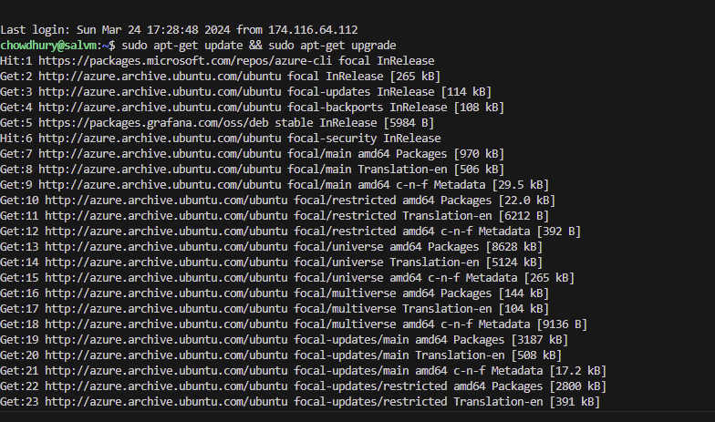
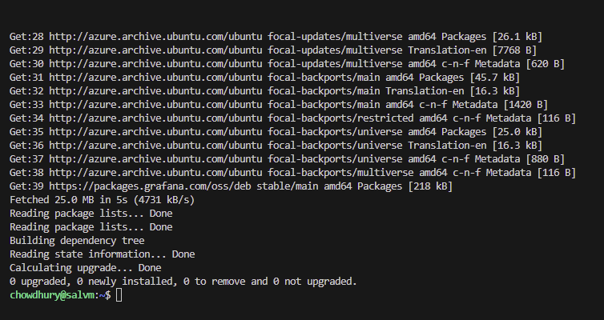

## Task 2: Install Grafana

I ran the scripts provided in the lab manual and verified that Grafna server is running
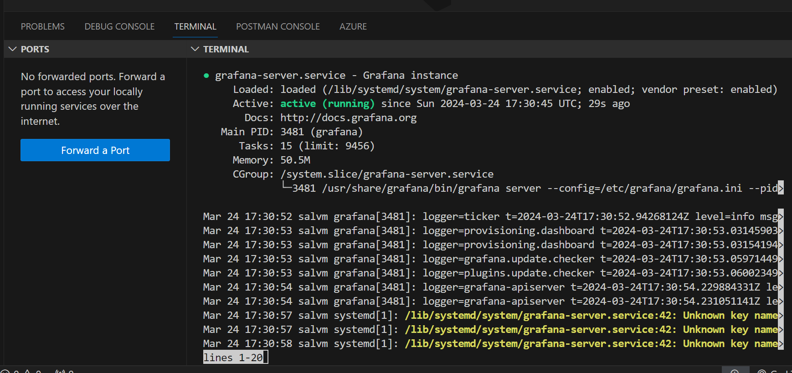

## Task 3: Install the Azure Monitor Agent

Using the instructions in lab manual , I installed azure CLI and was successfully connected to my account 

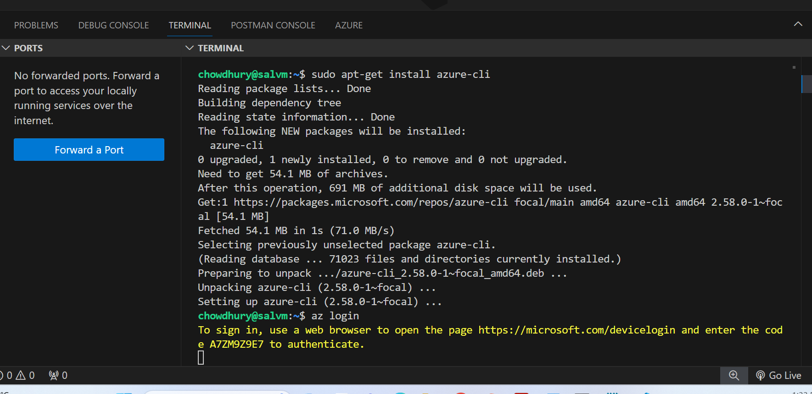
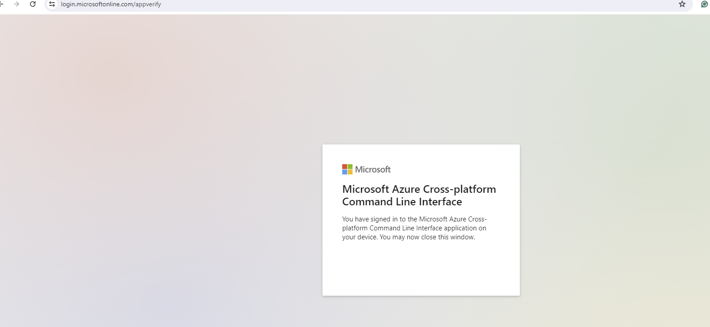

## Task 4: Collect Performance Metrics

Created log analytics workspace in Azure portal
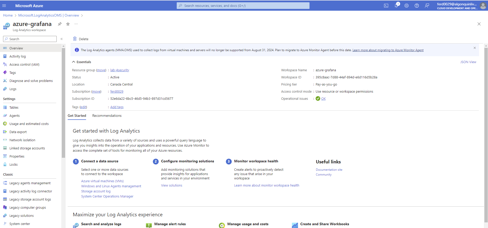

Created data collection rule and added the ubuntu VM as data source
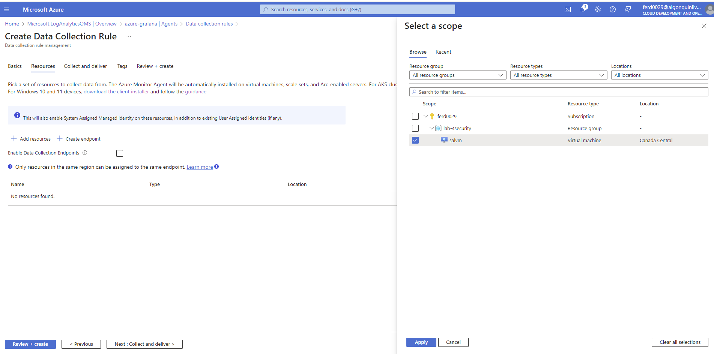

Collected performace metrics
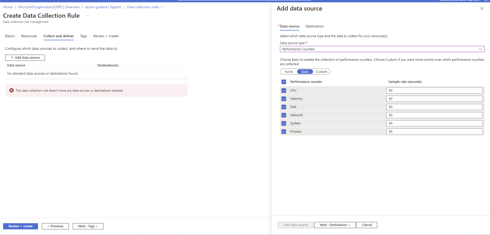

Monitor agent with Data collection rule is created
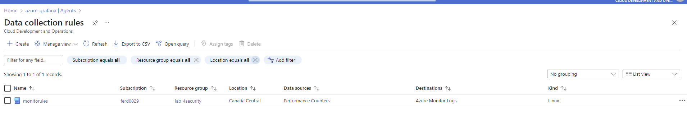

## Task 5: Connect Grafana to Azure Monitor
Create App regiter in azure portal
we can see the Tenant ID and APP ID there 
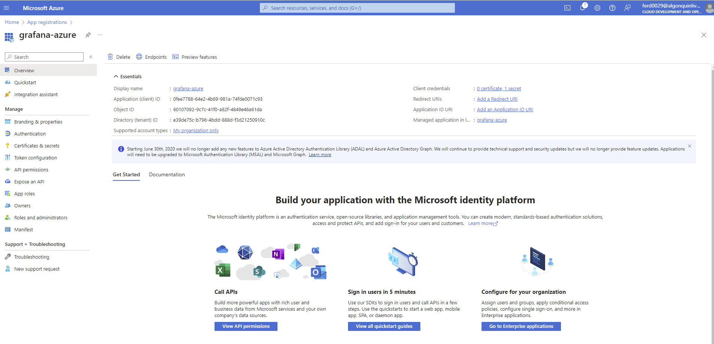

Then I created client certificate 
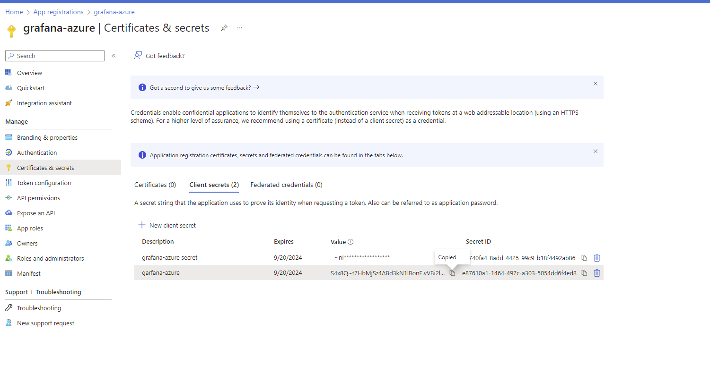

Added network inbound rule
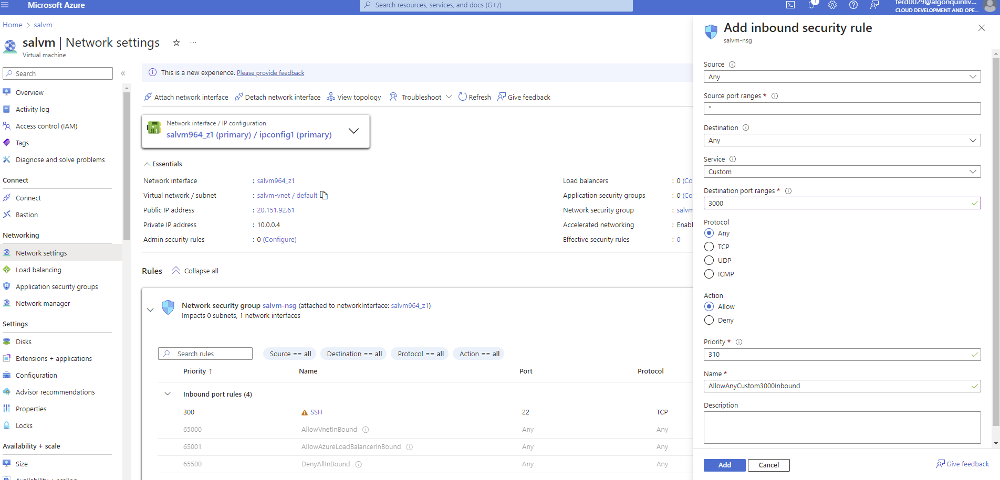

Open Grafana in your web browser (http://20.151.92.61:3000/login) and log in with the default credentials (admin/admin)

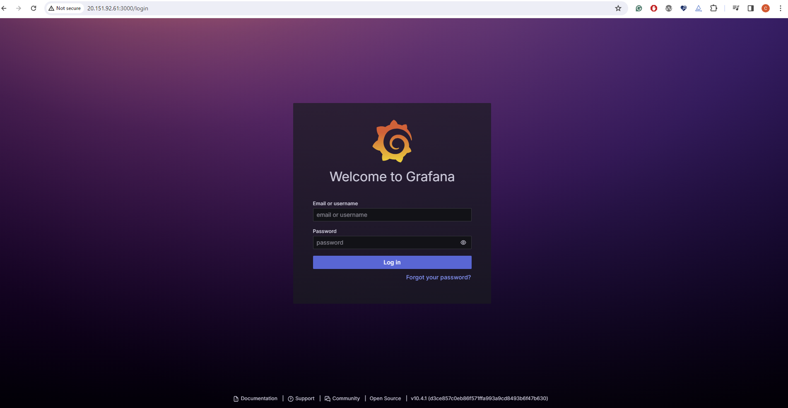

- Navigated to Configuration > Data Sources and click on “Add data source.”

- Selected “Azure Monitor” from the list.

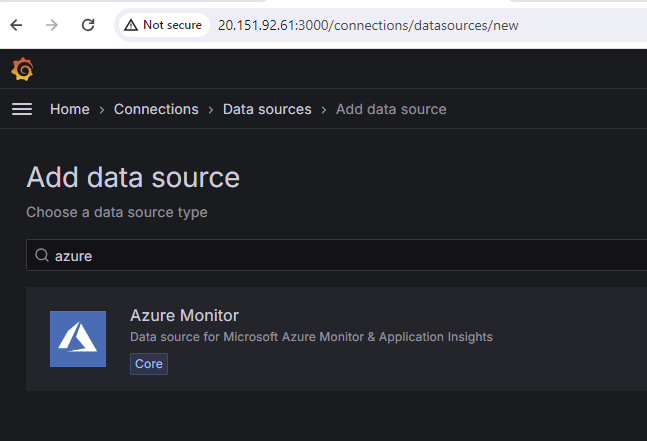

- Entered the details for Azure subscription, tenant ID, client ID, and client secret.
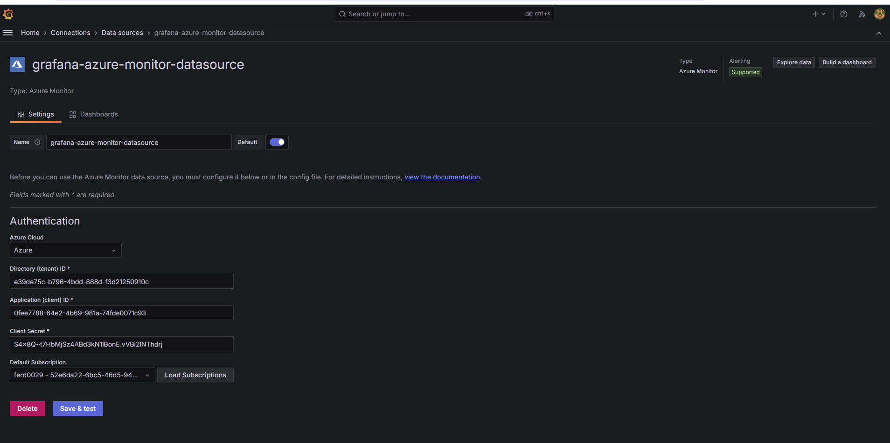

- Save and test the connection to ensure it is configured correctly.
Used the Client ID, App ID and Client secret

## Task 6: Create a Dashboard in Grafana

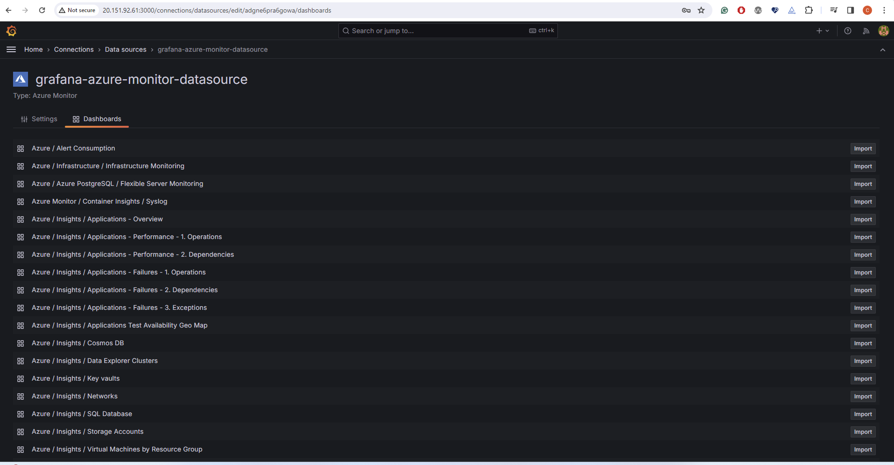

Imported  Resources Overview
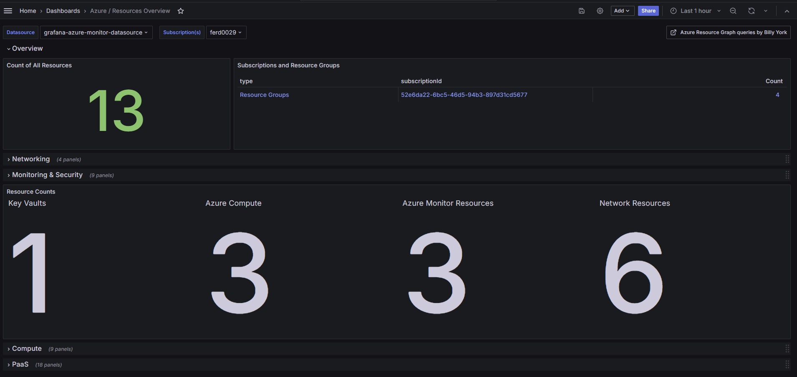

Imported Key vaults
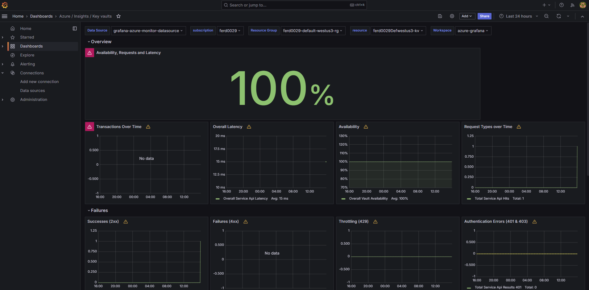
